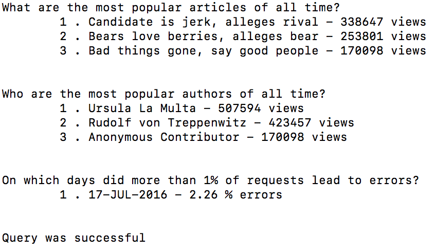

# Logs Analysis Project

Udacity: Full Stack Web Development Nanodegree

## About

An internal reporting tool that prints out reports based on data in a given database. The reporting tool being used is a Python program making use of the psycopg2 module in order to connect to the database. This module is used to query the database and produce results based on specific questions. The database is made up of three tables:

* An **articles** table - includes the articles
* An **authors** table - includes information about the authors articles
* A **log** table - includes information about when users enter the site

## Questions

1. What are the most popular three articles of all time?
2. Who are the three most popular article authors of all time?
3. On which days did more than 1% of requests lead to errors?

## What you'll need

1. Install [Vagrant](https://www.vagrantup.com/)
2. Install [VirtualBox](https://www.virtualbox.org/)
3. Go to [Udacity's Github](https://github.com/udacity/fullstack-nanodegree-vm) and download the files.
4. Download the **newsdata.sql** that is provided by Udacity
5. Move the **newsdata.sql** into the vagrant directory
6. Download this project and copy all files into the vagrant directory

## How to start up Virtual Machine

1. Open the terminal
2. *cd* into **vagrant** directory
3. Run *vagrant up* in order to build the VM
4. After it is done running, run *vagrant ssh* to connect to it
5. *cd* into the project directory
6. Use the following command: *psql -d news -f newsdata.sql* in order to load the data into database
7. Create the views found below in the *psql* terminal
8. Run the 'news.py' file: *python news.py*

The expected output can be found in the 'output.txt' file.

## Create views

**Views for Question 3:**

## Expected Output

## Resources

* [SQL Documentation](https://www.w3schools.com/sql/)
* [Select Statements](https://www.postgresql.org/docs/9.5/static/sql-select.html)
* [Create View](https://www.w3schools.com/sql/sql_view.asp)
* [Errors and Exceptions](https://docs.python.org/3/tutorial/errors.html)
* [Covert Datetime Value](http://www.sqlines.com/oracle-to-sql-server/to_char_datetime)
